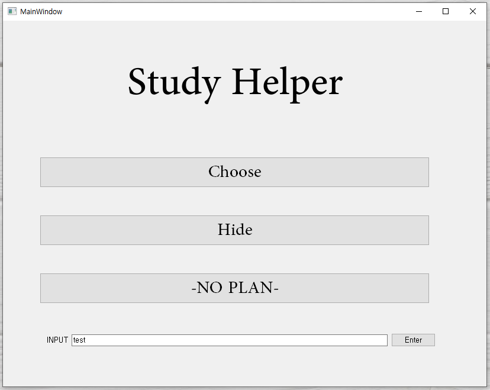

# Study Helper
When we need to remember something we have to repeat it many times. This program helps students

* * *
## Overview
1. 동기 : 한자3급을 따기 위해서 오랜만에 한자 단어를 외워다가 문제를 만들어주는 
    프로그램이 있으면 효율적인 공부가 가능하다. 따라서 한자 프로그램을 만든다. 
    이는 더 나아가서 일반적으로 학생들이 정리한 내용에 대하여 공부를 돕도록 작성되었다. 
    따라서 일반적으로 공부를 돕는 프로그램이다.

2. 프로그래밍 언어 : 파이썬
3. 작업환경 : PYQT5 + Pycharm 

- - - 
## How to Install

* Python version == **3.7**
* pyqt5 version ==  **5.11.3**

pyqt5의 경우 버전이 다르면 제대로 작동하지 않는 경우가 있습니다. 
가상환경에서 작동하도록 커맨드를 남기겠습니다. 
일단 Anaconda Prompt를 킵니다.

~~~
conda create -n StudyHelper python=3.7
activate StudyHelper
pip install pyqt5==5.11.3
py main.py 
~~~
- - -
## Program overview

- - -
## Structure of the program

작성중...

##
